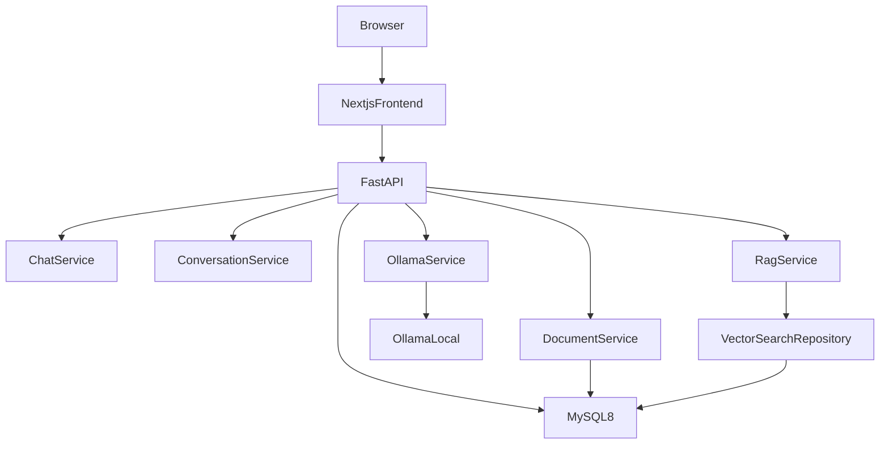

# Architecture

Status: Defined for the target shape. The FastAPI process, configuration, database session, and health route exist. Chat, document, RAG, and Ollama services are still Planned.

Local AI Assistant will be one Next.js application and one FastAPI application. FastAPI will talk to MySQL 8.x and to Ollama on the host. RAG will live inside FastAPI. The project will not add a second backend, a message broker, or a separate vector database in the current design.

## High-level architecture

```text
Browser
   │
   ▼
Next.js
   │
   ▼
FastAPI
   │
   ├── Chat Service
   ├── Conversation Service
   ├── Document Service
   ├── RAG Service
   └── Ollama Service
        │
        ▼
      Ollama

FastAPI
   │
   ▼
 MySQL
```



When a question uses uploaded files, the path will be:

```text
User uploads document
        │
        ▼
Document processing
        │
        ▼
Text extraction
        │
        ▼
Text chunking
        │
        ▼
Embedding generation
        │
        ▼
Vector storage
        │
        ▼
Semantic search
        │
        ▼
Relevant context
        │
        ▼
Ollama
        │
        ▼
Answer
```

## Layers

### Browser

The browser will render the workspace and send user actions to the Next.js application. It will not call Ollama or MySQL directly.

### Next.js frontend

Responsibility, planned:

- Layout, sidebar, conversation view, and composer.
- Call the FastAPI HTTP API.
- Render streamed assistant text, Markdown, and code blocks.
- Hold short-lived UI state such as the draft message and the selected model.

The frontend will not embed documents, run the model, or query MySQL. See [frontend.md](frontend.md).

### FastAPI backend

Responsibility, planned:

- Validate input and return structured errors.
- Persist conversations, messages, and document metadata.
- Orchestrate chat, file processing, and RAG.
- Call Ollama for chat and embeddings.

See [backend.md](backend.md) and [api.md](api.md).

### Chat service

Will accept a user message, load conversation history, optionally attach retrieved context, call the Ollama service, stream the reply, and store the user and assistant messages.

### Conversation service

Will create, list, rename, search, and delete conversations, and list their messages.

### Document service

Will accept uploads, validate files, store bytes under the upload directory, record metadata, and drive the processing status. It will not execute uploaded files.

### RAG service

Will extract and chunk text, request embeddings, save chunks, and retrieve passages for a question. Retrieval will go through the vector search repository. See [rag.md](rag.md).

### Ollama service

Will be the only language-model client. It will check that Ollama is reachable, list installed models, generate chat completions, stream tokens, and request embeddings. See [ai.md](ai.md).

### Vector search repository

Status: Defined as a boundary. Status: Planned as code.

All similarity search will pass through this repository. Callers will ask for relevant chunks and will not know whether vectors live in a MySQL column or in a later store. The planned first implementation stores embedding arrays on `document_chunks` rows and computes similarity in the backend process. See [decisions/README.md](decisions/README.md), Decision 005.

### MySQL

MySQL 8.x will store users, conversations, messages, documents, and document chunks. The schema is specified in [database.md](database.md) and is not migrated yet.

### Ollama

Ollama will run on the host and expose its local HTTP API. The chat model and the embedding model are configuration values, not fixed product choices.

## What this architecture excludes

The current design does not include Kubernetes, microservices, Redis, Kafka, RabbitMQ, agent-graph frameworks, Elasticsearch, or more than one backend process. It does not include cloud language-model APIs. It does not use PostgreSQL or a PostgreSQL vector extension.

Authentication is not part of Phases 1–10. The planned `users` table reserves ownership for conversations and documents. A login system would be a later decision, recorded in the decision log before any implementation.

## Related documents

- [Backend layout](backend.md)
- [Frontend](frontend.md)
- [Database](database.md)
- [API](api.md)
- [AI](ai.md)
- [RAG](rag.md)
- [Deployment](deployment.md)
